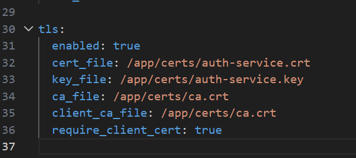
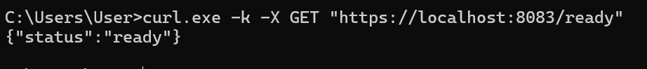
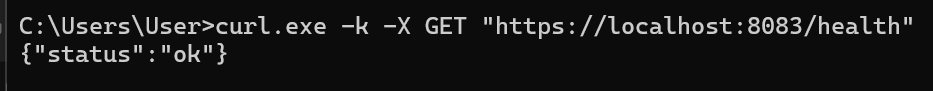
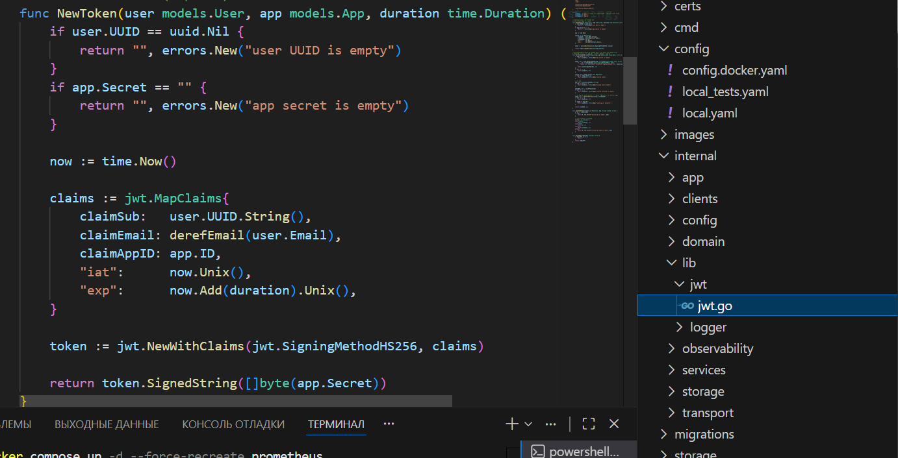
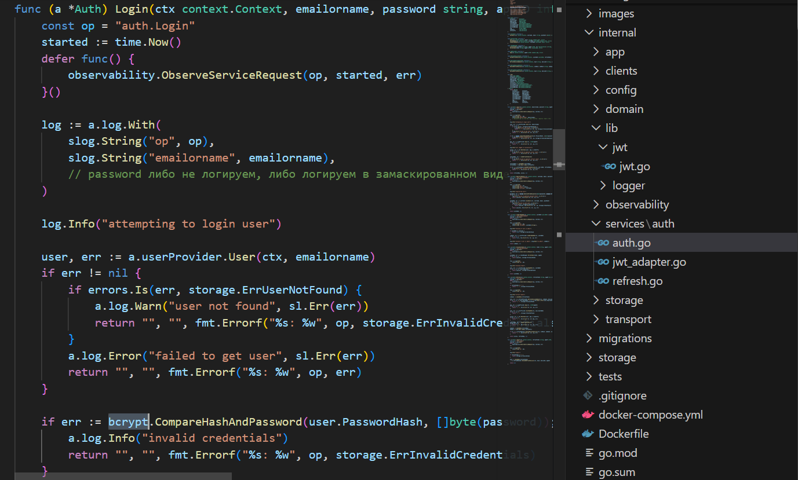
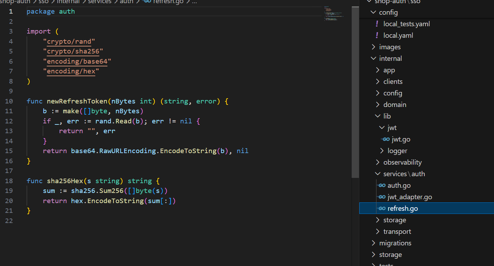

# Homework Report: TLS, mTLS, JWT, Hashing

Этот файл оформлен как итоговый отчет именно по текущему домашнему заданию. В нем intentionally не разбирается observability-часть проекта отдельно, а фиксируются только требования по безопасности, аутентификации и итоговому оформлению.

---

## 1. Цель домашнего задания

Требовалось:

1. настроить mTLS для общения между микросервисами;
2. настроить TLS для проверки HTTP-подключений;
3. добавить работу с JWT;
4. применить хеширование для хранения и проверки чувствительных данных;
5. оформить результат в markdown;
6. подготовить текстовый протокол проверок и скриншоты ключевых моментов.

---

## 2. Итоговая архитектура

В проекте реализована следующая схема:

```text
Client
  -> HTTPS
shop-gateway
  -> gRPC -> shop-catalog-service
  -> gRPC mTLS -> shop-auth
```

### Что это означает

1. внешний пользовательский трафик идет в `shop-gateway` по HTTPS;
2. `shop-gateway` обращается к `shop-auth` по gRPC с mTLS;
3. `shop-gateway` обращается к `shop-catalog-service` по gRPC;
4. JWT access token и refresh token flow реализованы в `shop-auth`;
5. хеширование вынесено в auth layer и не размазано по gateway.

---

## 3. Что реализовано по требованиям

### 3.1 mTLS между микросервисами

Защищенный межсервисный канал реализован между:

1. `shop-gateway -> shop-auth`

Что настроено:

1. у `shop-auth` включен TLS на gRPC server;
2. `shop-auth` требует client certificate;
3. `shop-gateway` использует:
   - CA certificate
   - client certificate
   - client private key
4. gateway проверяет серверный сертификат `shop-auth`;
5. readiness gateway учитывает доступность `shop-auth` через TLS health-check.





Итог:

1. `shop-auth` не принимает неподтвержденный gRPC client;
2. `shop-gateway` не подключается к недоверенному `auth-service`.

### 3.2 TLS для HTTP

Для внешнего HTTP-входа включен HTTPS на `shop-gateway`.

Что сделано:

1. gateway запускается через `ListenAndServeTLS(...)`;
2. к `shop-gateway` подключен server certificate и private key;
3. все внешние запросы выполняются через `https://localhost:8083`;
4. plain HTTP на этот порт больше не является корректным сценарием.

Итог:

1. gateway работает как защищенный edge-компонент;
2. внешний доступ к API идет по TLS.



### 3.3 JWT

JWT реализован собственной реализацией в `shop-auth`.

Что используется:

1. access token создается как JWT;
2. signing method — `HS256`;
3. в claims используются:
   - `sub`
   - `email`
   - `app_id`
   - `iat`
   - `exp`
4. token валидируется по secret приложения;
5. дополнительно проверяется `app_id`.

Итог:

1. авторизация централизована в `shop-auth`;
2. gateway делегирует token validation отдельному auth-сервису.



### 3.4 Хеширование

Используются две отдельные стратегии:

Для паролей:

1. `bcrypt.GenerateFromPassword(...)`
2. `bcrypt.CompareHashAndPassword(...)`

Для refresh token:

1. raw token генерируется криптографически стойко;
2. в БД хранится только `sha256` hash;
3. refresh rotation и revoke работают через hash.

Итог:

1. пароль не хранится в открытом виде;
2. refresh token не хранится как raw value;
3. при утечке БД исходные refresh token не раскрываются напрямую.




---

## 4. Пошаговая инструкция проверки

### 4.1 Поднять проект

```bash
cd shop-platform/deploy
docker compose up -d --build
docker compose ps
```

Ожидаемый результат:

1. `gateway-service` — `healthy`
2. `auth-service` — `healthy`
3. `catalog-service` — `healthy`

### 4.2 Проверить HTTPS gateway

```bash
curl -k https://localhost:8083/health
curl -k https://localhost:8083/ready
curl -k https://localhost:8083/products
```

Ожидаемый результат:

1. gateway отвечает по HTTPS;
2. `ready` возвращает `ready`;
3. `/products` работает через защищенный входной канал.

### 4.3 Проверить auth flow через gateway

Register:

```bash
curl -k -X POST https://localhost:8083/auth/register \
  -H "Content-Type: application/json" \
  -d '{"username":"demo","email":"demo@example.com","password":"Test123!"}'
```

Login:

```bash
curl -k -X POST https://localhost:8083/auth/login \
  -H "Content-Type: application/json" \
  -d '{"email_or_name":"demo","password":"Test123!","app_id":1,"device_id":"dev-1"}'
```

Validate:

```bash
curl -k -X POST https://localhost:8083/auth/validate \
  -H "Content-Type: application/json" \
  -d '{"token":"<access_token>","app_id":1}'
```

Ожидаемый результат:

1. пользователь успешно регистрируется;
2. login возвращает `access_token` и `refresh_token`;
3. validate возвращает `user_uuid`.

### 4.4 Проверить mTLS канал

Проверяется следующее:

1. `shop-auth` поднят с `require_client_cert: true`;
2. `shop-gateway` стартует только с корректным TLS client config;
3. auth-запросы через gateway работают;
4. readiness gateway учитывает доступность `auth-service`.

Косвенный признак успешной проверки:

1. `https://localhost:8083/ready` возвращает `ready`;
2. `register/login/validate` проходят через gateway;
3. при сломанной TLS-конфигурации gateway не сможет корректно подняться.

---

## 5. Текстовый протокол проверок

Фактическая последовательность проверки:

1. Поднят compose-стенд.
2. Проверены статусы контейнеров через `docker compose ps`.
3. Проверен `https://localhost:8083/health`.
4. Проверен `https://localhost:8083/ready`.
5. Проверен `https://localhost:8083/products`.
6. Выполнен `register`.
7. Выполнен `login`.
8. Выполнен `validate`.
9. Подтверждено, что gateway работает по HTTPS.
10. Подтверждено, что `shop-gateway -> shop-auth` использует mTLS.

---

## 6. Какие скриншоты приложить

Минимальный комплект для сдачи:

1. `01-compose-healthy.png`
   - `docker compose ps`
2. `02-gateway-ready-https.png`
   - `curl -k https://localhost:8083/ready`
3. `03-auth-register.png`
   - успешный `register`
4. `04-auth-login.png`
   - успешный `login`
5. `05-auth-validate.png`
   - успешный `validate`
6. `06-gateway-https-request.png`
   - запрос к `https://localhost:8083/products`
7. `07-mtls-config-proof.png`
   - конфиг или UI/лог, подтверждающий `require_client_cert: true` и использование client cert со стороны gateway

Если хочешь усилить отчет:

1. добавь скрин конфигурации `auth_tls` в gateway;
2. добавь скрин конфигурации TLS в `shop-auth`;
3. добавь скрин ответа `/ready`, где gateway уже зависит от auth и catalog.

---

## 7. Что сдавать

В рамках этого ДЗ должны быть подготовлены:

1. корневой `README.md`;
2. markdown-отчет по заданию;
3. PNG-скриншоты;
4. PR со всеми изменениями;
5. рабочая локальная сборка.
